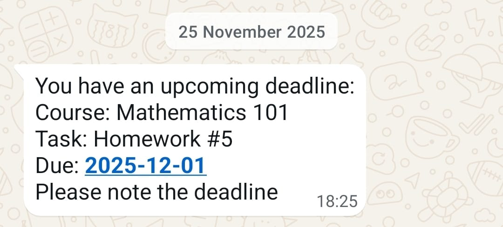
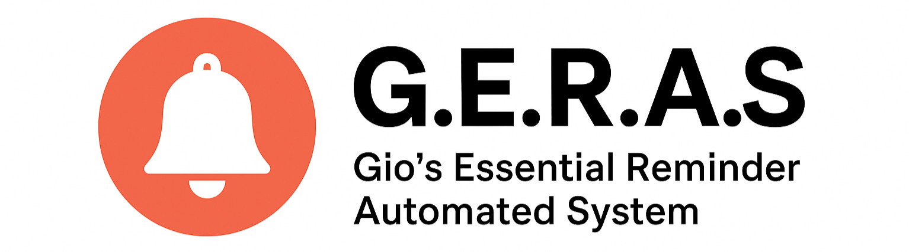

<h1 align="left">
  
  Blackboard Deadline Automation
  
</h1>
Blackboard Deadline Automation is a personal automation tool that fetches deadlines from Blackboard and sends reminders via WhatsApp. It was designed primarily for my personal university use.

---

<h3 align="left">
  Example: 
</h3>


## Features

* Fetches deadlines from Blackboard automatically.
* Sends WhatsApp reminders using **Meta’s [WhatsApp Cloud API](https://developers.facebook.com/docs/whatsapp/cloud-api/get-started)**.
* Uses existing session cookies when possible to avoid repeated logins.
* Headless browser support via Playwright if no cookies exist.
* Stores session cookies for faster subsequent runs.
* Fully configurable for personal accounts and time zones.

---

## Tech Stack

* Python 3.11
* Libraries: `playwright`, `pywa`, `requests`
* Meta WhatsApp Cloud API ([Guide](https://developers.facebook.com/docs/whatsapp/cloud-api/get-started))
> ⚠️ WhatsApp per-message pricing may apply: [Pricing](https://business.whatsapp.com/products/platform-pricing)
---

## Requirements

Set the following environment variables:

```
UNI_USER               # Blackboard username
UNI_PASS               # Blackboard password
TOKEN                  # Meta Cloud API token
PHONEID                # Sender phone number ID
PHONE                  # Receiver phone number
BUSINESS_ACOUNT_ID     # Meta Business Account ID
TIMEZONE               # Timezone for scheduling
TEMPLATE_NAME          # Approved WhatsApp message template name
```
---

## Installation

1. Clone the repository:

```bash
git clone https://github.com/GiovannyRaad/Blackboard-Deadline-Automation.git
cd Blackboard-Deadline-Automation
```

2. Create a virtual environment:

```bash
python3 -m venv venv
source venv/bin/activate
```

3. Install dependencies:

```bash
pip install -r requirements.txt
```

4. Download the browser Playwright drives:

```bash
playwright install firefox
```

5. Create a `.env` file with the environment variables listed above.

---

## Usage

```bash
python main.py
```

* The bot will attempt to use existing cookies from `cookies.json` to log into Blackboard.
* If no cookies exist, a Playwright headless browser will log in and store cookies in the JSON file.
* Fetches upcoming deadlines and sends reminders via WhatsApp.
* Intended to be scheduled to run periodically (e.g., weekly).

> Logs and message delivery tracking via Meta Webhooks are planned but not yet implemented.

---

## Project Structure

```
.env
main.py                                  # ties fetching and sending together
requirements.txt
skills/
  blackboard-deadlines/                  # the deadline-fetching skill
    SKILL.md
    headlessEventsFetcher.py
    eventsFetcher.py                     # WIP browser-free SAML login
    cookies.json                         # cached session, written on first login
    requirements.txt
whatsapp/                                # reminder delivery
  messageSender.py
  webhook.py
  requirements.txt
```

---

## License

```
MIT License

Copyright (c) 2025 GiovannyRaad

Permission is hereby granted, free of charge, to any person obtaining a copy of this software and associated documentation files (the "Software"), to deal in the Software without restriction, including without limitation the rights to use, copy, modify, merge, publish, distribute, sublicense, and/or sell copies of the Software, and to permit persons to whom the Software is furnished to do so, subject to the following conditions:

The above copyright notice and this permission notice shall be included in all copies or substantial portions of the Software.

THE SOFTWARE IS PROVIDED "AS IS", WITHOUT WARRANTY OF ANY KIND, EXPRESS OR IMPLIED, INCLUDING BUT NOT LIMITED TO THE WARRANTIES OF MERCHANTABILITY, FITNESS FOR A PARTICULAR PURPOSE AND NONINFRINGEMENT. IN NO EVENT SHALL THE AUTHORS OR COPYRIGHT HOLDERS BE LIABLE FOR ANY CLAIM, DAMAGES OR OTHER LIABILITY, WHETHER IN AN ACTION OF CONTRACT, TORT OR OTHERWISE, ARISING FROM, OUT OF OR IN CONNECTION WITH THE SOFTWARE OR THE USE OR OTHER DEALINGS IN THE SOFTWARE.
```



